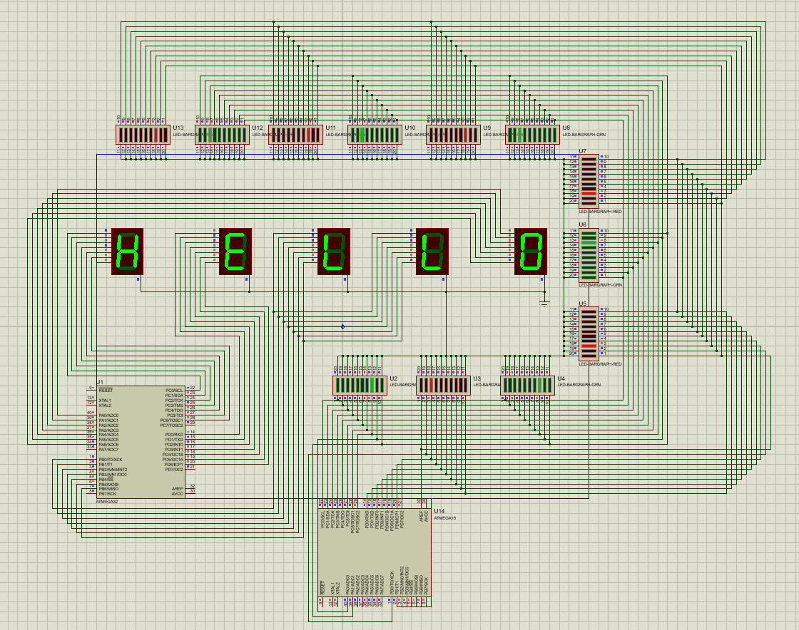

# AVR Seven-Segment Display and LED Bargraph Project

This project is an embedded application for the ATmega32 microcontroller. It uses 5 seven-segment displays to print "HELLO ALL GOOD" and 12 LED bargraphs for aesthetic effects. The microcontroller controls the displays and LEDs through specific ports, providing a dynamic visual output.

## Screenshot

## Features

- **5 Seven-Segment Displays**: The microcontroller displays the message "HELLO ALL GOOD" on 5 seven-segment displays, controlling each segment individually.
- **12 LED Bargraphs**: The system controls 12 LED bargraphs for aesthetic effects using the available ports. These bargraphs can be used to display dynamic lighting effects.
- **ATmega32 Microcontroller**: The program is designed for the ATmega32 with an 8 MHz clock frequency.

## Hardware Setup

- **Microcontroller**: ATmega32
- **Seven-Segment Displays**: 5 seven-segment displays connected to ports A, B, C, and D.
- **LED Bargraphs**: 12 LED bargraphs connected to ports A, B, C, and D.
  
The program controls the seven-segment displays to print letters and numbers, while the LED bargraphs can create aesthetic effects in the system.

## Connections

1. **Seven-Segment Displays**: 
   - 5 displays connected to ports A, B, C, and D.
   - Each segment of the seven-segment display is controlled by the corresponding bit in the port register (e.g., `PORTA`, `PORTB`, etc.).

2. **LED Bargraphs**: 
   - 12 LED bargraphs connected to the respective pins of ports A, B, C, and D.

## Code Explanation

1. **Initialization**: 
   - The I/O ports for the seven-segment displays and LED bargraphs are initialized as outputs.
   - Timers and other peripherals are configured but not actively used in this particular program.

2. **Seven-Segment Display Control**:
   - The program cycles through the required patterns to display the characters "HELLO ALL GOOD" by writing specific values to the port registers controlling the seven-segment displays.
   - Each port value corresponds to a character or number on a seven-segment display.

3. **LED Bargraph Control**:
   - The program can dynamically control the state of the 12 LED bargraphs by writing values to the corresponding port registers.

4. **Delays**:
   - The program includes a delay of 1.5 seconds between character transitions for the seven-segment displays to make the message readable.

## Installation

1. Connect the ATmega32 microcontroller to the development board.
2. Wire up the 5 seven-segment displays and 12 LED bargraphs to the specified ports.
3. Compile the code using an AVR toolchain (e.g., Atmel Studio or avrgcc).
4. Flash the firmware onto the ATmega32 microcontroller.

## Usage

Once the program is flashed onto the ATmega32, it will automatically start displaying "HELLO ALL GOOD" on the seven-segment displays, alternating between various display patterns. The LED bargraphs will also be activated for aesthetic purposes, adding visual appeal to the project.

## Example Display Output

- "HELLO" will be displayed across the first four seven-segment displays.
- "ALL GOOD" will be displayed across the remaining two displays.
- LED bargraphs will light up in a pattern as a part of the aesthetic effect.

## Troubleshooting

- **Seven-Segment Display Not Working**: Double-check the connections for each segment of the seven-segment displays and ensure they are correctly wired to the respective ports.
- **LED Bargraphs Not Lighting**: Verify the connections to the LED bargraphs and ensure the correct values are written to the port registers.

## Author

- Created by [Mohammd H. Moazzen](https://github.com/TirdadMH) 
- Date: June 8, 2023